# 2026-06-21

## 🎯 今日重点

- [x] 咕泡继续前进至少一课
- [x] Python编程从入门到实践-函数和类
- [ ] 动手学习深度学习

## 📝 笔记
1、AIDC(人工智能数据中心)--门为处理人工智能工作负载而设计和优化的新型数据中心,是集成高性能计算、大数据处理、人工智能算法与云计算服务的公共算力基础设施
2‌‌、概念点:
	VLA模型即视觉-语言-动作模型,是让机器看懂、听懂并直接动作的端到端的AI系统
	WAN世界动作模型,让机器人联合建模未来状态与动作,不仅能执行动作,还能理解物理规律和预判场景变化 。
	LIBERO-Plus OOD:具身智能领域用于评测机器人操作模型的一个基准测试
3、World Pilot: Steering Vision-Language-Action Models with World-Action Priors：
	在 VLA 模型的决策链中通过两条互补通道注入 WAM（世界-动作模型）的"场景演化潜变量"和"动作轨迹先验"，让机器人拥有了预判世界变化的"副驾驶"，LIBERO-Plus OOD 基准达 SOTA **84.7%**。

```mermaid
graph TB
    subgraph 输入["📥 输入"]
        IMG["🖼️ 图像"]
        LANG["📝 语言指令"]
    end

    subgraph WAM["🧠 WAM 世界-动作模型 (冻结)"]
        WAM_FUTURE["预测未来场景"]
        WAM_TRAJ["预测粗略轨迹"]
    end

    subgraph VLA["🤖 VLA 决策链"]
        VLM["VLM 骨干<br/>视觉-语言编码"]
        HIDDEN["隐藏状态<br/>h"]
        ACT_GEN["动作生成器<br/>continuous control"]
        OUTPUT["🎮 机器人动作"]
    end

    IMG --> VLM
    LANG --> VLM
    VLM --> HIDDEN

    WAM_FUTURE -->|"🔵 LatentSteering<br/>交叉注意力残差注入"| HIDDEN
    WAM_TRAJ -->|"🟠 ActionSteering<br/>压缩为单令牌前缀"| ACT_GEN

    HIDDEN --> ACT_GEN
    ACT_GEN --> OUTPUT

    style WAM fill:#1a1b2e,stroke:#bb9af7,color:#bb9af7
    style VLA fill:#1a1b2e,stroke:#7aa2f7,color:#7aa2f7
    style VLM fill:#2a2d45,stroke:#7aa2f7
    style HIDDEN fill:#2a2d45,stroke:#7aa2f7
    style ACT_GEN fill:#2a2d45,stroke:#7aa2f7
```

	（1）三条通路协同工作架构：
		1）语义通路：图像+语言 → VLM → 隐藏状态 → 动作生成器（经典 VLA）
		2）LatentSteering 🔵：WAM 预测未来场景 → 场景演化潜变量 → 交叉注意力残差注入 VLM 隐藏状态
		3）ActionSteering 🟠：WAM 预测粗略轨迹 → 压缩为单令牌 → 前缀插入动作生成器
	(2)关键设计:
		1)潜变量 > 解码图像:去除像素中包含的光影、纹理、生成伪影等与控制无光的因素
		2)单令牌 > 多令牌:保留整体运动趋势,避免生成器硬绑到WAM每步噪声
		3)WAM冻结+30%Dropout正则:低成本训练,且强制模型不过度依赖先验
	(3)实验亮点
		- **LIBERO-Plus(10030 个 OOD 任务,7 种维度)**: 综合 **84.7% SOTA**,比 ABot-M0 基线提升 4.2 pp
		- **视角变化维度**: **82.8%,超第二名 13.2 pp** - 直接验证 WAM 视频预训练的视角不变性可迁移至 VLA
		- **真实机器人 4 任务 × 3 版本 = 12 设置全部最高成功率**;OOD 场景降幅仅 ≤20 pp(其他方法 25-50 pp)
		- **容器盖子对齐**(几何精度要求极高):World Pilot 13-14/20,其他方法最多 6/20
		- **纯视频预训练 WAM(未动作微调)仍提升 2.1 pp**:证明互联网视频中的物理知识已有零样本迁移价值

## 💡 想法 / 灵感
1、论文启发与局限:
	(1)启发与可借鉴
		1. **"先验注入"范式**:WAM 冻结、仅微调融合模块,几乎零额外训练成本→在自动驾驶/无人机等领域均可复用
		2. **信息形态 > 信息量**:潜变量去噪、单令牌抽象--保留与控制目标对齐的信号,剔除无关维度
		3. **Dropout 正则化先验依赖**:简单有效的训练技巧,确保先验不可用时系统仍能稳健运行
		4. **视频预训练知识零样本迁移**:证明互联网视频中的物理知识可"白嫖"到操作任务
	(2)潜在局限
		5. **上限由 WAM 覆盖范围决定** - 未见过的物体/环境→先验退化→增益收缩
		6. **提升不均衡** - 语言指令变化、布局变化等维度不如最强基线
		7. **实时性受限** - 每步需额外一次 WAM 前向,不适合高频任务
		8. **代码未开源** - 复现门槛较高

## 🔗 连接

- [[VLA 模型]] - 当日首次了解的 VLA/WAN 概念
- [[机器视觉学习路线]] - 学习主路径
- [[2026年6月23日]] - 后续论文精读笔记

---
← 上一天:- | 下一天:[[2026年6月23日]] →

## 📊 回顾

- 完成了什么:咕泡继续前进,Python 书函数完成,类还剩一些内容未完成
- 学到了什么:AIDC/VLA/WAN 概念入门,World Pilot 论文研读(SOTA 84.7%),终端操作
- 明天继续:把类和文件读取完成,咕泡开始 YOLO 学习
