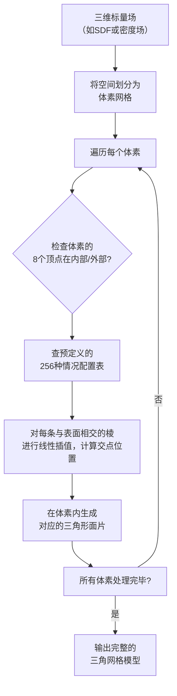

**Marching Cubes**（移动立方体）是一种经典的3D表面提取算法，功能是**从三维标量场（如密度场或距离场）中提取出三角网格表面**。

它和我们之前讨论过的**泊松重建**、**FlexiCubes**属于同类算法——都是将隐式表示转化为显式网格的桥梁。但Marching Cubes是其中最经典、历史最悠久的方法。

### 🧠 核心思想：分而治之

这个算法的巧妙之处在于，把一个复杂的大问题，分解成无数个简单的小问题来处理：

1.  **体素化**：首先，把三维空间划分成大量小立方体（体素），就像用3D网格把空间切成小方块。
2.  **查表生成三角形**：对于每个小立方体，检查它8个顶点上的数值（如密度或SDF），判断哪些顶点在物体**内部**、哪些在**外部**。根据8个顶点的“内/外”组合，总共有256种情况。算法预先设计好了一个查找表，**对于每一种情况，都知道应该在这个小立方体内生成多少个三角形、以及三角形顶点应该放在哪里**。
3.  **线性插值**：当一条棱的两个端点一个在内部、一个在外部时，说明物体表面**恰好穿过了这条棱**。为了得到更精确的表面位置，Marching Cubes会在棱上进行**线性插值**，计算出表面与棱的交点。
4.  **拼接**：对所有小立方体都执行上述操作后，得到的三角形面片自然会拼接成一个连续的、完整的表面。

### ⚙️ 算法步骤图例

为了让你有更直观的印象，以下是Marching Cubes核心步骤的示意：

### 😅 它的缺点

虽然Marching Cubes极其经典，但它有几个显著的局限：

1.  **拓扑歧义**：在某些顶点配置下，表面连接方式不唯一，算法可能产生错误的空洞或不连续。
2.  **锯齿和阶梯效应**：因为网格是规则的立方体，提取出的表面往往带有粗糙的“锯齿”边缘，不够平滑。
3.  **无法优化**：Marching Cubes是一个**不可微分**的过程。这意味着，如果生成的网格不够好，梯度无法反向传播去优化底层的隐式场。

### 🔗 它与FlexiCubes的关系

**FlexiCubes正是为了克服Marching Cubes的这些缺点而设计的**：

| 特性 | Marching Cubes | FlexiCubes |
| :--- | :--- | :--- |
| **核心方法** | 固定立方体网格 | 可变形立方体网格 |
| **表面质量** | 有锯齿，需后处理 | 更平滑，缺陷更少 |
| **可微分性** | **否** | **是** |
| **能否端到端训练** | 否 | 是 |
| **灵活性** | 低（顶点位置固定） | 高（顶点可自由移动） |

FlexiCubes通过引入可学习的顶点偏移和可微分的表面提取过程，使得神经网络可以**端到端**地学习生成高质量的网格，这正是现代3D深度学习（包括你论文中的相关技术）所需要的。

