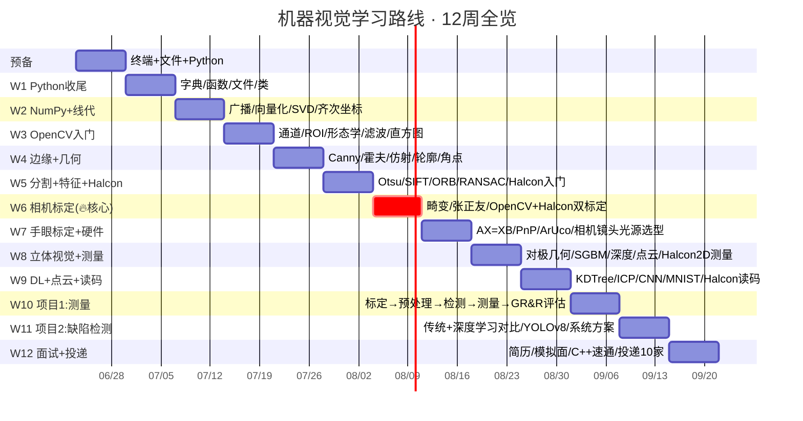

# 朱小明 · 机器视觉学习路线（唯一执行版）

> 📅 最后更新：2026-06-23
> 🎯 目标岗位：南京江宁区·机器视觉应用工程师（8-15K起步）
> ⏱ 投入：工作日3-4h，周末6-8h | 硬件：Mac M1
> ⚡ **使用方式：打开本文档→翻到当前天→逐条执行→打完钩再往下**

---

## ⚠️ 读这个之前

**这份是你唯一需要看的学习文档。** archive/ 里的旧版本已归档，不用再看。

**就业数据确认：** 南京江宁区机器视觉岗（埃斯顿/多伦科技/耘瞳科技等）正在招人。要求 Halcon+OpenCV+相机标定+硬件选型，恰好是你的路线。你每多规划一天就晚一天够格投递。

**现在就做：**
1. 打开 BOSS 直聘，收藏 3 个"南京·江宁区·机器视觉应用工程师"JD
2. 每完成 2 周，回头对比 JD 要求，看自己对上几条
3. W9 起每天投 2-3 家练手

---

## 🗺️ 路线全景



## 📅 日期映射（从今天开始）

> 🗓 **Day -14 = 2026-06-23（周二）** ← 今天

| 阶段 | 天/周 | 真实日期 | 主题 |
|------|-------|----------|------|
| 预备 | D-14 | **6/23 周二** | 终端初体验 |
| | D-13 | 6/24 周三 | 文件操作 |
| | D-12 | 6/25 周四 | Python+VS Code |
| | D-11 | 6/26 周五 | 变量 |
| | D-10 | 6/27 周六 | 数据类型+运算 |
| | D-9 | 6/28 周日 | 输入+格式化输出 |
| | D-8 | 6/29 周一 | 小结日 |
| W1 | | **6/30 → 7/6** | Python收尾→NumPy |
| W2 | | **7/7 → 7/13** | NumPy+线代 |
| W3 | | **7/14 → 7/20** | OpenCV入门+图像处理 |
| W4 | | **7/21 → 7/27** | 边缘+几何+特征 |
| W5 | | **7/28 → 8/3** | 分割+特征+Halcon入门 |
| W6 | | **8/4 → 8/10** | 相机模型+Halcon标定 |
| W7 | | **8/11 → 8/17** | 手眼标定+硬件+Halcon模板 |
| W8 | | **8/18 → 8/24** | 立体视觉+Halcon测量 |
| W9 | | **8/25 → 8/31** | DL入门+点云+Halcon读码 |
| W10 | | **9/1 → 9/7** | 项目1：测量系统 |
| W11 | | **9/8 → 9/14** | 项目2：缺陷检测 |
| W12 | | **9/15 → 9/21** | 面试+C++速通 |
| 🎯 | | **9/22起** | 开始正式投递！ |

> 💡 看到上表中哪几周最吓人了吗？**W5-W8**（7/28→8/24）。这四周别安排任何人生大事。

---

## ⚡ 每日启动检查清单（打开本文档先做这3步）

```
□ 1. 终端输入 cv（激活conda + 进入工作目录）
□ 2. 翻到今天 → 看是星期几 → 找到对应任务行
□ 3. 至少完成⭐任务 → 打完钩 → 打卡：python3 tracker.py checkin "Day X" N "备注"
```

> 今天如果只做一件事，就做那个⭐。完成了，今天就过关。

---

## 掌握等级

| 等级 | 含义 | 检验方式 |
|------|------|---------|
| **L3·能造** | 不看文档从头写 | 空白 .py 独立完成 |
| **L2·能讲** | 理解原理，能解释为什么 | 录音讲一遍 |
| **L1·知道** | 知道存在，用到时能查 | 能看懂别人的代码 |

> ⭐ 标记 = 最低完成线。每天先做完⭐，就算完成。其余可滑。

---

# 预备阶段：Day -14 到 Day -8

> 🎯 从零到能写 Python 小程序
> ⏱ 每天 2-3 小时
> ⚠️ 这是整个计划的地基，跳过必崩

---

## Day -14｜计算机是什么 + 终端初体验

> 🗓 2026-06-23（周二）

### ⭐核心任务
- [ ] 打开终端：`Cmd+空格` → 输入"终端" → 回车
- [ ] 输入 `pwd`，回车。看到输出（例：`/Users/zhuxiaoming`）
- [ ] 输入 `ls`，回车。看到 Desktop、Documents 等文件夹名
- [ ] 输入 `cd Desktop`，回车 → `pwd` 确认到了桌面 → `cd ..` 回到上一级
- [ ] **理解：** `pwd` = 我在哪 / `ls` = 这有什么 / `cd` = 去那个位置
- [ ] 输入 `cv`，回车 → 看到终端提示符前面出现 `(cv)` → ✅ 你的学习环境已激活
- [ ] 输入 `ls` → 看到 `week01` `week02` … `week12` → 这是你的工作目录

### 弹性任务
- [ ] B站搜"计算机科学速成课"，看第1-3集（CPU/内存/操作系统是什么）
- [ ] 探索：`cd ~/cv_learning/week01` → `pwd` → `cd ..` → 熟悉在目录间跳转

---

## Day -13｜文件操作

> 🗓 2026-06-24（周三）

### ⭐核心任务
- [ ] 终端输入 `cv` → 进入工作目录
- [ ] `mkdir -p week_prep` → `ls` 能看到 `week_prep` 和 `week01` 等并排
- [ ] `cd week_prep` → `touch day13_test.txt` → `ls` 能看到它
- [ ] `echo "hello terminal" > day13_test.txt` → `cat day13_test.txt` 看到内容
- [ ] `cd ..` → `rm -rf week_prep/day13_test.txt` → 确认已删除
- [ ] **理解：** 相对路径（`./file`）vs 绝对路径（`~/cv_learning/file`）
- [ ] 画一下 `~/cv_learning/` 的目录树结构（纸和笔）

### 弹性任务
- [ ] 在 week_prep 内建三层嵌套文件夹（`mkdir -p a/b/c`），然后删掉

---

## Day -12｜认识 Python + VS Code + 第一个程序

> 📌 你的环境已装好（conda cv），Day -12 跳过安装步骤，直接体验。

### ⭐核心任务
- [ ] 终端输入 `cv` → 进入工作目录
- [ ] `python3 --version` → 确认看到 Python 3.10
- [ ] 打开 VS Code（如果没装：code.visualstudio.com 下载）
- [ ] 装 VS Code Python 扩展（扩展商店搜 "Python" → 安装 Microsoft 官方那个）
- [ ] 新建文件 `week_prep/day12_hello.py` → 写 `print("Hello，我是小明！")`
- [ ] 终端运行 `python3 week_prep/day12_hello.py` → 看到输出 → ✅
- [ ] 试试改一下输出文本 → 再运行 → 理解：代码文件 + 终端运行 = 基本工作流

### 弹性任务
- [ ] B站搜"VS Code Python 配置"，看3分钟视频了解调试按钮怎么用
- [ ] 创建 `week_prep/` 文件夹（预备阶段代码放这里）

---

## Day -11｜变量是什么

> 🗓 2026-06-26（周五）

### ⭐核心任务
- [ ] 终端输入 `cv` → 进入工作目录 → `cd week_prep`
- [ ] 理解一句话：「`x = 10` 是把 10 放进叫 x 的盒子，不是数学等式」
- [ ] 打开 VS Code，创建 `week_prep/day11_variables.py`：
  ```python
  name = "小明"
  age = 25
  city = "南京"
  print(name, age, city)
  ```
- [ ] 终端运行 `python3 day11_variables.py`（确保在 week_prep 目录下）
- [ ] 试试：把 `age` 改成字符串 `"25"`，能运行吗？改回来
- [ ] 试试：`print(name + city)` → 理解字符串拼接

### 弹性任务
- [ ] 定义 3 个关于自己信息的变量，print 出来

---

## Day -10｜数据类型 + 运算

> 🗓 2026-06-27（周六）

### ⭐核心任务
- [ ] 终端输入 `cv` → `cd week_prep`
- [ ] 四种类型：`int`（整数）、`float`（小数）、`str`（字符串）、`bool`（True/False）
- [ ] `type()` 查看类型：`print(type(10))` → `<class 'int'>`
- [ ] 数字运算：`+ - * / // % **` → 各试一次 print
- [ ] 字符串拼接：`"你好" + "小明"` → `"你好小明"`
- [ ] `len("hello")` → `5`
- [ ] 创建 `week_prep/day10_types.py`，把今天练的运算都写进去，加注释说明每行在干什么

### 弹性任务
- [ ] 写"点餐计算器"：输入数量和单价，输出总价。提示：
  ```python
  price = 15
  count = 3
  total = price * count
  print(f"总价：{total}元")
  ```

---

## Day -9｜用户输入 + 格式化输出

> 🗓 2026-06-28（周日）

### ⭐核心任务
- [ ] 终端输入 `cv` → `cd week_prep`
- [ ] `input()` 接收用户输入：
  ```python
  name = input("你叫什么名字？")
  print(f"你好，{name}")
  ```
- [ ] ⚠️ input 进来的永远是字符串，用 `int()` / `float()` 转换：
  ```python
  age_str = input("年龄？")
  age = int(age_str)
  print(f"明年你{age + 1}岁")
  ```
- [ ] `f-string`：`f"你好，{变量名}"`
- [ ] 创建 `week_prep/day09_io.py`

### 弹性任务
- [ ] 写"自我介绍生成器"：输入姓名、年龄、爱好 → 输出一段完整的自我介绍

---

## Day -8｜🧹 小结日

> 🗓 2026-06-29（周一） 📌 预备阶段最后一天

### ⭐核心任务
- [ ] 终端输入 `cv` → `cd week_prep`
- [ ] 把 Day -14 到 Day -9 的所有代码，不看参考从头写一遍
- [ ] 卡住了回去看，理解了再写，不是抄
- [ ] 写成 `week_prep/prep_review.py`
- [ ] 创建 `week_prep/` 子文件夹 `day10_types.py` `day11_variables.py` `day12_hello.py` `day09_io.py` `day13_file_ops.py`
- [ ] 把之前的代码移到对应文件里，整理好

### 弹性任务
- [ ] 挑战：写"迷你计算器"，两个数 + 一个运算符 → 输出结果
  ```python
  a = float(input("第一个数："))
  op = input("运算符(+,-,*,/)：")
  b = float(input("第二个数："))
  if op == "+":
      print(a + b)
  # ... 补全其他三种
  ```
- [ ] 运行 `bash ~/cv_learning/check.sh` → 确保全绿 ✅ → 预备阶段完成！

---

# 第一阶段：第1-12周 · 初级视觉工程师

> 🎯 产出：2个项目+可投递简历
> 🛠 工具线：前4周 Pure OpenCV筑基 → 第5周起 OpenCV+Halcon双轨

---

## 环境准备 ✅ 已完成（2026-06-23）

> 🟢 **环境已全部搭建完毕，你不需要重新安装。** 这里留存记录，供换电脑/重装参考。

### 当前环境

| 项目 | 值 |
|------|----|
| Python | 3.10.20（conda cv） |
| Conda | /opt/anaconda3/ |
| 工作目录 | ~/cv_learning/ |
| 快速启动 | `cv`（一键激活+进入目录） |

已安装核心包：OpenCV 4.13 + contrib · NumPy 2.2.6 · SciPy 1.15 · PyTorch 2.12(MPS) · ONNX 1.23 · Open3D 0.19 · Pytest 9.1

### 每次学习前

```bash
cv               # 一键激活环境 + 进入工作目录
bash check.sh    # 30秒自检（可选）
```

### 应急重装参考

```bash
conda create -n cv python=3.10 -y && conda activate cv
pip install opencv-python opencv-contrib-python numpy matplotlib scipy scikit-learn pytest torch torchvision onnxruntime open3d -i https://pypi.tuna.tsinghua.edu.cn/simple
mkdir -p ~/cv_learning/{week0{1..9},week{10..12},data/{images,outputs}}
```

---

## 第1周：Python基础收尾 → NumPy入门

> ⭐=9个 | OpenCV🟢 | Halcon❌ | 🗓 6/30→7/6

| 天 | 任务 | 等级 | 产出 |
|----|------|------|------|
| **一** | ⭐字典增删改查、遍历、dict comprehension；集合去重/交集/并集/差集 | L3 | `week01/dict_set_practice.py` |
| **二** | ⭐`def`/参数类型/`return`多值；`lambda`/`map`/`filter`基础 | L3 | `week01/functions.py` |
| **三** | ⭐`with open()`+`os.listdir`/`os.walk`/`glob`；`try/except/finally` | L3 | `week01/file_io.py` |
| **四** | ⭐`class`/`__init__`/`self`/实例方法；练习`ImageFile`类（封装路径+宽高+格式） | L3 | `week01/class_basics.py` |
| **五** | ⭐`import`+`__name__=='__main__'`；`pip`/`requirements.txt`；包结构 | L3 | 整理 week01/ 为包 |
| **六** | ⭐Mini项目：命令行图片浏览工具（遍历→列出→显示尺寸→排序） | L3 | `week01/image_browser.py` |
| **日** | ✅环境验证：`python -c "import cv2; import numpy as np; print(cv2.__version__)"` + ⭐过渡任务：纯 Python list 做 100×100 矩阵相乘→计时→体会痛苦→预览 `np.dot` | L3 | 录音自检 |

### 📚 第1周资源
- 🔵网盘：博学谷I352·阶段一 Python基础（字典→函数→类→文件→模块）
- 🟢全网：[B站阿里大牛OpenCV 200集 1-2节](https://www.bilibili.com/video/BV1ZV4y1c7Yt/)

---

## 第2周：NumPy + 线性代数地基

> ⭐=9个 | OpenCV🟢 | 🗓 7/7→7/13
> 📐 **线代集中周：** 本周学的矩阵运算是 W6 标定的前置知识。每掌握一个概念就想：这会在 W6 标定里怎么用？

| 天 | 任务 | 等级 | 产出 |
|----|------|------|------|
| **一** | ⭐axis参数+广播机制（3个能广播+1个不能）；花式索引vs布尔索引；`uint8`溢出陷阱（255+1=0） | L3 | `week02/numpy_basics.py` |
| **二** | ⭐纯for vs `np.dot` 矩阵乘法计时对比（np.dot快>100倍）；把一段for循环改成向量化 | L3 | `week02/vectorization_demo.py` |
| **三** | 矩阵乘法几何意义+SVD图像低秩近似；⭐齐次坐标：为什么视觉里用齐次坐标？ | L2-L3 | `week02/svd_compression.py` |
| **四** | ⭐手写灰度化+NumPy切片翻转/裁剪/缩放；手写直方图均衡化 | L3 | `week02/image_as_array.py` |
| **五** | Git基础→提交代码到GitHub；⭐pytest写2个测试；⭐Type Hints给函数加类型标注；cProfile：`python -m cProfile -s cumtime script.py` | L2-L3 | `week02/utils.py`+`test_utils.py` |
| **六** | 梯度/偏导数直观理解；⭐最小二乘法推导；A4纸手写推导→拍照留存 | L2 | |
| **日** | CheatSheet一页纸+录音自检+本周最想放弃的时刻：______ | L3 | |

### 📚 第2周资源
- 🔵网盘：博学谷I352·阶段五 高等数学（线代/矩阵/SVD）
- 🟢全网：[3Blue1Brown线性代数](https://www.youtube.com/playlist?list=PLZHQObOWTQDPD3MizzM2xVFitgF8hE_ab) | [B站OpenCV 200集 3-4节](https://www.bilibili.com/video/BV1ZV4y1c7Yt/)

---

## 第3周：OpenCV入门 + 图像处理管线

> ⭐=7个 | OpenCV🟢 | 🗓 7/14→7/20
> 📐 **线代微剂量：** 从本周起，每天睡前抽15分钟做一道 NumPy 矩阵题（`np.dot`/`np.linalg.inv`/`np.linalg.eig`），保持肌肉记忆到 W6 标定周。

| 天 | 任务 | 等级 | 产出 |
|----|------|------|------|
| **一** | ⭐`imread`各flag、BGR vs RGB；`imwrite`压缩质量；通道分离/合并；HSV三个通道含义 | L2-L3 | `week03/opencv_basics.py` |
| **二** | ⭐`cv2.add` vs `+`、位运算、mask；⭐ROI概念（产线80%检测只处理ROI）；图像格式陷阱（JPEG有损→边缘偏移→做实验对比JPEG vs PNG Canny差异）；像素当量认知（`FOV/像素数`）；平场校正认知 | L1-L3 | `week03/image_operations.py` |
| **三** | 膨胀/腐蚀；⭐开运算vs闭运算（面试常考）；`connectedComponents` | L2 | `week03/morphology.py` |
| **四** | 卷积直观理解；⭐高斯滤波σ影响+中值滤波（高斯对椒盐不好/对高斯好，面试常考）；双边滤波+`filter2D` | L2-L3 | `week03/filtering.py`（6种滤波对比图） |
| **五** | ⭐`calcHist`+`equalizeHist`+CLAHE；⭐gamma校正：`img ** (1/gamma)` | L2 | `week03/histogram.py` |
| **六** | ⭐综合练习：工业零件图→去噪→分割→计数→标注（至少两种滤波+两种分割对比） | L3 | `week03/part_counter.py` |
| **日** | ⚡闪电回顾：默写 NumPy广播/`imread→灰度→高斯→Canny→轮廓`+录音自检 | L3 | |

### 📚 第3周资源
- 🔵网盘：博学谷I352·阶段八 2D机器视觉
- 🟢全网：[B站200集 5-14节](https://www.bilibili.com/video/BV1ZV4y1c7Yt/) | [B站OpenCV4实战 1-20节](https://www.bilibili.com/video/BV1fv4y127Pv/)

---

## 第4周：边缘检测 + 几何变换 + 特征入门

> ⭐=7个 | OpenCV🟢 | 🗓 7/21→7/27
> ⚠️ **本周日提前装 Parallels 虚拟机！** 别拖到 W5，那天已有 SIFT+RANSAC 三重压力。

| 天 | 任务 | 等级 | 产出 |
|----|------|------|------|
| **一** | Sobel推导+⭐合并梯度幅值和方向；Scharr、Laplacian | L2 | `week04/gradients.py` |
| **二** | ⭐Canny四步骤（高斯→NMS→双阈值→边缘连接），逐像素理解；手写NMS对比验证；亚像素精度极限认知 | L2-L3 | `week04/canny_edge.py` |
| **三** | 霍夫变换直觉+`HoughLinesP`实战；霍夫圆变换 | L2 | `week04/hough_transform.py` |
| **四** | ⭐仿射变换矩阵+透视变换+A4纸校正实战 | L3 | `week04/geometric_transform.py` |
| **五** | `findContours`模式区别+轮廓特征（面积/周长/矩形度/圆度）；Hu矩不变性 | L2 | `week04/contour_analysis.py` |
| **六** | Harris角点原理+`goodFeaturesToTrack`+`cornerSubPix` | L2 | `week04/corner_detection.py` |
| **日** | ⭐小项目：A4纸上圆形/三角形/矩形→去噪→边缘→轮廓→分类→位置+录音自检Canny四步骤 | L3 | |
| **日2** | 🖥️ **提前装Parallels虚拟机：** 下载Parallels Desktop试用 → 安装Win11 ARM → 安装Halcon试用版 → 验证能打开HDevelop（为W5省出整天学习时间） | L1 | |

### 📚 第4周资源
- 🔵网盘：博学谷I352·阶段八 | 🟢全网：[B站200集 15-26节](https://www.bilibili.com/video/BV1ZV4y1c7Yt/) | [B站OpenCV4实战 21-38节](https://www.bilibili.com/video/BV1fv4y127Pv/)

---

## 第5周：图像分割 + 特征描述子 + 🆕Halcon入门

> ⭐=8个 | OpenCV🟢 | Halcon🆕本周末起步 | 🗓 7/28→8/3

| 天 | 任务 | 等级 | 产出 |
|----|------|------|------|
| **一** | ⭐Otsu推导+自适应阈值 | L2 | `week05/threshold_segmentation.py` |
| **二** | 分水岭地形浸水模型+⭐粘连物体分割 | L2 | `week05/watershed.py` |
| **三** | `matchTemplate`+多尺度+局限；⭐SIFT原理（尺度空间→方向→128维→光照不变），口头L3：能从头到尾讲出来 | L2-L3 | `week05/sift_notes.md` |
| **四** | FAST+BRIEF原理；⭐`orb.detectAndCompute`→`BFMatcher`→`drawMatches`，对比SIFT效果和速度 | L2-L3 | `week05/orb_matching.py` |
| **五** | ⭐RANSAC vs 最小二乘；`findHomography`拼接 | L2 | `week05/ransac_stitch.py` |
| **六** | 🆕 **Halcon环境搭建：** Parallels虚拟机装Win11 ARM → 装Halcon试用版 → 打开HDevelop → 读第一张图 → ROI → 灰度化 → 二值化 → 形态学 → 跑通预处理全流程 | L1 | `week05/halcon_first.hdev` |
| **日** | ⚡闪电回顾：默写Canny+轮廓/形态学开闭运算+录音自检SIFT vs ORB | L3 | |

### 📚 第5周资源
- 🔵网盘：博学谷I352·阶段八 | 🟢全网：[GitHub OpenCV-Python-Tutorial](https://github.com/makelove/OpenCV-Python-Tutorial) | 🆕B站「Halcon机器视觉」播放量最高系列

---

## 第6周：相机模型 + Halcon标定（面试分水岭）

> ⭐=9个 | OpenCV🟢 | Halcon🟢 | 🗓 8/4→8/10 | ⚠️全网补丁重点
> 🔥 **这是整个计划最重要的单周。** 标定是面试必问第一题，学不透后面全塌。本周如果卡住，允许把其他任务全滑到下周一，但标定不能滑。

| 天 | 任务 | 等级 | 产出 |
|----|------|------|------|
| **一** | ⭐四坐标系+投影链：`λ·[u,v,1]ᵀ = K·[R丨t]·[Xw,Yw,Zw,1]ᵀ`；fx/fy/cx/cy物理含义；手写`project_point(K,R,t,point_3d)` | L3 | `week06/camera_projection.py` |
| **二** | ⭐径向畸变（桶形/枕形，k1/k2/k3）+切向畸变p1/p2；写畸变函数，画网格图展示畸变效果 | L3 | `week06/distortion_model.py` |
| **三** | ⭐张正友标定原理：角点→单应性→约束方程→内参→外参→优化；为什么≥3张？重投影误差含义 | L2 | `week06/zhang_notes.md` |
| **四** | ⭐打印棋盘格→拍20张（不同角度/距离/覆盖四角）；标定板精度认知（A4≈0.1mm vs 玻璃≈0.001mm）；标定平面原则（标定板必须放工件所在平面） | L2-L3 | 图片放`calib_images/` |
| **五** | ⭐`calibrateCamera`完整流程；⭐重投影误差<0.5px合格，<0.2px优秀；`initUndistortRectifyMap`+`remap` | L3 | `week06/camera_calibration.py` |
| **六** | 🆕 **Halcon标定助手：** 同样20张图用Halcon走一遍标定→对比OpenCV结果→理解商业工具"一键标定" | L2 | `week06/halcon_calib.hdev` |
| **日** | ⭐标定报告（内参+畸变+校正对比，OpenCV vs Halcon双版本）+录音自检完整流程 | L3 | |

### 📚 第6周资源 ⚠️ 全网补丁必看
- 🔥 [CSDN张正友标定5分钟跑通](https://blog.csdn.net/redis7keeper/article/details/155083636)
- 🔥 [知乎张正友推导](https://zhuanlan.zhihu.com/p/94244568)
- 🔥 [CSDN ChArUco标定](https://blog.csdn.net/2503_90912287/article/details/157022214)
- 🆕B站「Halcon标定助手教程」

---

## 第7周：手眼标定 + 位姿估计 + 硬件理论

> ⭐=7个 | OpenCV🟢 | Halcon🟢 | 🗓 8/11→8/17 | ⚠️网盘空缺，全网补丁

| 天 | 任务 | 等级 | 产出 |
|----|------|------|------|
| **一** | ⭐手眼标定原理：Eye-in-hand vs Eye-to-hand、AX=XB、Tsai-Lenz | L2 | `week07/hand_eye_notes.md` |
| **二** | ⭐ArUco：`getPredefinedDictionary`+`detectMarkers`+`estimatePoseSingleMarkers` | L3 | `week07/aruco_basics.py` |
| **三** | ⭐PnP问题定义+EPnP直观理解+`solvePnPRansac` | L2 | `week07/pnp_pose.py` |
| **四** | 模拟Eye-to-hand+`calibrateHandEye` | L2 | `week07/hand_eye_calib.py` |
| **五** | ⭐**硬件选型理论（面试高频）：** 相机选型`像素≥FOV/精度`；镜头选型`f=(传感器尺寸×WD)/FOV`；光源选型（环形/条形/背光/同轴/穹顶）；偏光片/滤光片；光圈与景深权衡 | L2 | `week07/hardware_cheatsheet.md` |
| **六** | 🆕 **Halcon模板匹配：** `create_shape_model`→`find_shape_model`→实战PCB板MARK点定位 | L2 | `week07/halcon_shape_match.hdev` |
| **日** | ⚡闪电回顾：默写project_point/畸变函数/ORB detectAndCompute → 录GIF传GitHub | L3 | |

### 📚 第7周资源 ⚠️ 全程全网
- 🔥 [GitHub Hand-Eye with OpenCV](https://github.com/JCRONG96/-Hand-Eye-with-opencv)
- 🔥 [腾讯云工业相机选型](https://cloud.tencent.com/developer/article/2600109) | [镜头选型](https://cloud.tencent.com/developer/article/2600114)
- 🔥 [NI照明指南](https://www.ni.com/en/shop/choosing-the-right-hardware-for-your-vision-applications/a-practical-guide-to-machine-vision-lighting.html)

---

## 第8周：立体视觉 + Halcon测量入门

> ⭐=6个 | OpenCV🟢 | Halcon🟡 | 🗓 8/18→8/24

| 天 | 任务 | 等级 | 产出 |
|----|------|------|------|
| **一** | ⭐下载KITTI stereo 2015数据集；理解数据集格式 | L3 | `week08/dataset_loader.py` |
| **二** | ⭐对极几何直觉（极线/极点/对极平面）+E和F的关系；画对极几何图 | L2 | `week08/epipolar_geo.py` |
| **三** | ⭐为什么校正（2D搜索→1D搜索）；Bouguet算法；画水平线验证行对齐 | L2-L3 | `week08/stereo_rectify.py` |
| **四** | ⭐视差`d = B·f/Z`；BM vs SGBM；`StereoSGBM_create`调参 | L2 | `week08/stereo_matching.py` |
| **五** | 视差→深度`Z = B·f/d`；`reprojectImageTo3D`→点云；Open3D入门 | L2 | `week08/depth_pointcloud.py` |
| **六** | 🆕 **Halcon 2D测量：** 边缘检测+卡尺工具→几何拟合（线/圆/矩形）→尺寸计算→用硬币/标准件实测 | L2 | `week08/halcon_measure.hdev` |
| **日** | 画出立体视觉管线+录音自检 | L2 | |

### 📚 第8周资源
- 🔥 [知乎双目视觉深度图（源码+教程）](https://zhuanlan.zhihu.com/p/570116246)
- 🔥 [KITTI数据集](https://www.cvlibs.net/datasets/kitti/) | [LearnOpenCV Stereo Vision](https://learnopencv.com/stereo-vision-and-depth-estimation-using-opencv-ai-kit/)
- 🆕 B站「Halcon测量卡尺工具教程」

---

## 第9周：DL入门 + 点云 + Halcon读码

> ⭐=6个 | OpenCV🟢 | Halcon🟡 | 🗓 8/25→8/31
> ⚠️ **本周是三个阶段中最分散的：** 点云(3D) → DL(2D) → Halcon(读码) 三个完全不相关的主题。如果感到认知负荷太高，把Halcon读码推到 W10 周四（项目1测完空闲时间）。

| 天 | 任务 | 等级 | 产出 |
|----|------|------|------|
| **一** | ⭐KD-Tree（knn搜索/半径搜索）+八叉树认知 | L2 | `week09/pc_basics.py` |
| **二** | ⭐体素下采样+统计滤波+半径滤波 | L2 | `week09/pc_filtering.py` |
| **三** | ⭐ICP原理（最近点→SVD→迭代）+Open3D ICP实战 | L2 | `week09/pc_registration.py` |
| **四** | ⭐MLP前向传播手算+CNN为什么适合图像（局部感受野/权重共享/池化） | L2 | `week09/dl_notes.md` |
| **五** | Tensor+autograd+nn.Module；⭐MNIST训练：acc > 95% | L2-L3 | `week09/pytorch_mnist.py` |
| **六** | 🆕 **Halcon读码+OCR：** 条码/二维码识别+OCR字符识别 | L1 | `week09/halcon_ocr.hdev` |
| **日** | ⚡闪电回顾：默写calibrateCamera流程/手眼标定两种配置+录音自检CNN→YOLO | L2 | |

### 📚 第9周资源
- 🔵网盘：博学谷I352·阶段九 3D点云PCL + 阶段十 深度学习
- 🟢全网：[CSDN Open3D ICP](https://blog.csdn.net/qq_45512728/article/details/137332334)

---

## 第10周：🏗️ 项目1——精密零件视觉测量系统

> ⭐=12个 | 🎯灵魂周——产出第一个完整可展示项目 | 🗓 9/1→9/7

| 天 | 任务 | 等级 | 产出 |
|----|------|------|------|
| **一** | ⭐GitHub新建仓库`vision-measurement-system`；项目结构`config.yaml`+`src/`+`tests/`+`data/`；⭐配置文件驱动（所有参数放yaml）；每个.py带type hints | L3 | `src/calibrator.py` |
| **二** | ⭐预处理模块：图像加载+畸变校正+透视校正 | L3 | `src/preprocessor.py` |
| **三** | ⭐检测模块：Canny亚像素边缘+轮廓提取+直线/圆拟合 | L3 | `src/detector.py` |
| **四** | ⭐测量模块：像素当量计算（标定板已知尺寸→`像素当量=实际mm/像素数`）→几何计算（长度/宽度/直径/圆度/角度） | L3 | `src/measurer.py` |
| **五** | ⭐精度评估：已知尺寸物体测10次→均值/标准差/最大偏差；⭐ImageJ/Fiji测量同一批零件对比；⭐重复性评估（同零件测30次→标准差）；⭐⭐GR&R认知（<10%优秀/10-30%可接受/>30%不合格）；误差分析报告 | L2-L3 | `src/evaluator.py`+误差分析文档 |
| **六** | README+效果图+上传GitHub；⭐写≥2个pytest；⭐Docker认知（15分钟）；⭐**每天投2-3家练手**；🆕Halcon版对比：同一批零件用Halcon测一遍→记录差异→面试时说"OpenCV和Halcon都做过" | L1-L3 | `week10/halcon_vs_opencv.md` |
| **日** | 误差最大环节是哪个？为什么？重复性合格吗？录音自检测量系统管线 | L3 | |

### 📚 第10周资源
- 🔥 [CSDN GR&R完整教程](https://blog.csdn.net/qq_45006390/article/details/120900034)
- 🔥 [ImageJ/Fiji官网](https://imagej.net/software/fiji/) | [知乎Docker极简](https://zhuanlan.zhihu.com/p/137895577)

---

## 第11周：🏗️ 项目2——工业缺陷检测系统

> ⭐=8个 | 🎯第二项目+开始投递 | 🗓 9/8→9/14

| 天 | 任务 | 等级 | 产出 |
|----|------|------|------|
| **一** | ⭐NEU-DET数据集（6类1800张）+数据分析+⭐LabelImg标注10张图 | L3 | `week11/data_explore.py` |
| **二** | ⭐HOG+GLCM+LBP→特征拼接→SVM分类（传统方法管线） | L3 | `week11/traditional.py` |
| **三** | ⭐YOLOv8n训练（Colab GPU）+数据增强（翻转/旋转/亮度/马赛克）→监控mAP | L3 | `week11/yolo_train.py` |
| **四** | ⭐对比表：mAP/Recall/推理速度/模型大小；⭐**缺陷检测核心难点笔记**（过杀/漏杀/阈值困境/缺陷定义模糊/GR&R视角） | L2-L3 | `week11/model_compare.py`+`defect_notes.md` |
| **五** | 推理demo+⭐ONNX导出→`onnxruntime`推理速度对比；🆕了解Halcon DL工具+用Halcon跑同一数据集 | L1-L2 | `week11/inference.py`+`onnx_export.py` |
| **六** | ⭐虚拟方案设计：手机外壳划痕检测（节拍60件/分钟/150×75mm/缺陷0.05mm）→相机/镜头/光源/算法/通信/过杀vs漏杀/GR&R | L2 | `week11/system_design.md` |
| **日** | ⚡闪电回顾：默写calibrateCamera/光源类型/MNIST训练循环；⭐**每天投2-3家**，被问倒的当天补上 | L3 | |

### 📚 第11周资源
- 🔵网盘：博学谷I352·阶段十 深度学习 | 唐宇迪深度学习系统班（进阶参考）
- 🟢全网：[Ultralytics YOLOv8](https://github.com/ultralytics/ultralytics) | [B站YOLOv8 1h](https://www.bilibili.com/video/BV1Nm4y167Z2/) | [ONNX部署](https://developer.baidu.com/article/detail.html?id=3314862) | [MakeSense标注](https://www.makesense.ai/)

---

## 第12周：面试准备 + 🆕C++速通

> ⭐=11个 | 🎯全力投递 | 🗓 9/15→9/21

| 天 | 任务 | 等级 |
|----|------|------|
| **一** | ⭐技术简历：STAR法则+量化结果+1页+GitHub链接；找3人看简历 | L3 |
| **二** | ⭐录音每题30秒：相机模型/畸变/张正友标定/Canny/SIFT/手眼标定/光源选型/过杀漏杀/GR&R；转文字自读 | L3 |
| **三** | 离开文档写出：⭐`imread→灰度→GaussianBlur→Canny→轮廓→画框`；NumPy广播；手写卷积+YOLO推理 | L2-L3 |
| **四** | ⭐每个项目准备3/5/15分钟三版本陈述+录视频练习 | L3 |
| **五** | ⭐找朋友做模拟面+反向面试（必须满足3条件/不能接受3红线）；问面试官：工具链/2D还是3D/光源谁负责/PLC通信/做不做GR&R | L3 |
| **六** | 🆕 **C++速通Day1：** 基本语法+变量类型+if/for/while+函数定义（目标：能看懂，不求能写） | L1 |
| **日** | ⭐Boss直聘/猎聘完善简历+投10家；🆕 **C++速通Day2：** 类与对象+指针引用+STL vector/map | L1 |

### 📚 第12周资源
- 菜鸟教程C++篇 | B站「黑马程序员C++」前20集

---

## 🏁 第一阶段完成画像

```
✅ 用OpenCV独立开发定位+测量+检测项目
✅ Halcon基本操作跑通（标定/模板匹配/测量/读码）
✅ 独立完成相机/镜头/光源选型
✅ 2个完整GitHub项目可展示
✅ GR&R、过杀漏杀等面试核武器掌握
✅ Python工程能力（pytest/Type Hints/cProfile/配置驱动）
✅ C++基础（能看懂代码）
💰 可投递：视觉应用工程师 / 初级视觉工程师
💰 预期薪资：南京 8-13K / 京沪深 12-18K
```

---

# 远期路径（第13周起 · 18个月蓝图）

## 第二阶段：第13-32周（第4-8月）· 能力升级

> 目标：3D视觉+深度学习+C++上位机 → 可投 15-22K

| 月 | 周 | 内容 | 关键产出 |
|----|----|------|---------|
| **4** | 13-16 | YOLOv8深度(多尺度/超参/mAP)+ONNX→TensorRT+C++重写项目1预处理+Halcon导出C+++QT入门 | 缺陷模型v2+C++视觉程序 |
| **5** | 17-20 | **买工业相机(海康/大恒USB，几百块)**+QT深度(多线程/信号槽/图表)+Modbus TCP | 真实标定报告+QT视觉软件 |
| **6** | 21-24 | Open3D/PCL深度+结构光/线激光原理+点云平面拟合+Halcon 3D工具 | 3D测量demo |
| **7** | 25-28 | 手眼标定进阶(Tsai-Lenz)+**项目3：3D引导PCB定位**+PPF匹配+**项目4(王牌)：3D无序抓取** | 2个3D项目 |
| **8** | 29-32 | 4个项目写进简历+模拟面试+全力投递3D视觉岗 | 升级版简历(目标15-22K) |

## 第三阶段：第33-72周（第9-18月）· 具身智能

- 第9-10月：Ubuntu+ROS2 Humble+Gazebo仿真场景
- 第11-12月：仿真中视觉引导机械臂抓取+缺陷自动分拣
- 第13-15月：Isaac Sim进阶+域随机化+合成数据生成
- 第16-18月：Isaac Lab编程+Sim2Real迁移实验+**终极大项目：仿真训练视觉抓取→部署真实机器人**

> 🎯 远景画像：工业视觉+机器人仿真双栖 | 可投高级视觉/具身智能仿真 | 25-40K

---

# 附录A：15条学习原则

1. **代码>理论**：每学一个概念必须写代码
2. **Debug是学习**：每个bug都是一次深入理解的机会
3. **不要Jupyter**：用.py文件+命令行运行
4. **不求全懂**：第一遍跑通，第二遍扣细节，第三遍自己写
5. **周日必复盘**：宁可少学一天，不要跳过复盘
6. **先广后深**：卡住超过2小时就问AI/搜/跳过
7. **看标签做事**：L3闭卷默写 / L2理解+能讲 / L1跑通即可
8. **英文搜索**：所有技术搜索用英文关键词
9. **录音自检**：每周日晚录讲解，自己听逻辑断点
10. **⚡闪电回顾**：每两周日15分钟默写核心代码
11. **⭐防崩**：完成⭐就算过关，宁可滑到下周，不停下
12. **图没拍好别做算法**：工业视觉第一课是打光
13. **学完就写一行**：每个概念用自己的话写一行解释
14. **产线思维**：算法再牛，产线上一个光源角度不对就全废
15. **测量是量具**：视觉测量系统就是一件数字量具，用GR&R检验它 ⭐

---

# 附录B：闪电回顾日历

| 周 | 默写内容（15分钟，不看资料） |
|----|---------|
| W3 | NumPy广播+亮度调整 / imread→灰度→轮廓提取 |
| W5 | Canny+轮廓 / 形态学开闭运算 |
| W7 | project_point / 畸变函数 / ORB detectAndCompute |
| W9 | calibrateCamera / 手眼标定两种配置 |
| W11 | calibrateCamera完整代码 / 光源类型 / MNIST训练循环 |

---

# 附录C：面试常考20问

| # | 题目 | 等级 | 回溯周 |
|---|------|------|--------|
| 1 | 相机标定的原理是什么？为什么需要标定？ | L3 | W6 |
| 2 | 畸变有哪些类型？怎么校正？ | L3 | W6 |
| 3 | 图像滤波有哪些？高斯vs中值各用在什么场景？ | L3 | W3 |
| 4 | Canny边缘检测的步骤？每步做什么？ | L3 | W4 |
| 5 | SIFT和ORB有什么区别？ | L2 | W5 |
| 6 | 单应性矩阵和基础矩阵有什么区别？ | L2 | W5+W8 |
| 7 | 立体匹配的原理？SGBM比BM好在哪？ | L2 | W8 |
| 8 | PnP问题是什么？EPnP的直觉？ | L2 | W7 |
| 9 | YOLO的大致流程？为什么快？ | L2 | W11 |
| 10 | GIL是什么？多线程vs多进程？ | L1 | W2 |
| 11 | 检测精度0.05mm，FOV 100mm，最少需要多少像素？ | L2 | W7 |
| 12 | 环形光源和背光源分别适用什么场景？ | L2 | W7 |
| 13 | 镜头焦距、工作距离、FOV之间的关系？ | L2 | W7 |
| 14 | GigE、USB3、CameraLink各有什么优缺点？ | L1 | W7 |
| 15 | 检测结果怎么传给PLC？ | L1 | W7+远期 |
| 16 | 模型训练好后怎么部署到产线？ | L2 | W11 |
| 17 | 缺陷检测中过杀和漏杀怎么平衡？⭐ | L2 | W11 |
| 18 | 线扫相机和面阵相机有什么区别？⭐ | L1 | W7 |
| 19 | 视觉测量系统的精度怎么评估？GR&R是什么？⭐⭐ | L2 | W10 |
| 20 | 远心镜头和普通镜头有什么区别？⭐ | L1 | W7 |

---

# 附录D：工业视觉概念速查（L1/L2）

| 概念 | 一句话解释 | 在哪 |
|------|-----------|------|
| 像素当量 | 每个像素代表多少毫米，= FOV/像素数 | W3 |
| ROI | 产线80%检测只处理图像一小块区域 | W3 |
| JPEG陷阱 | 有损压缩→边缘偏移→测量不准，产线用BMP/PNG/TIFF | W3 |
| 平场校正 | 补偿照明不均+镜头暗角，分割前做 | W3 |
| ChArUco标定 | 棋盘格被挡也能标定，更鲁棒 | W6 |
| 标定平面原则 | 标定板必须放在测量平面，不能有高度差 | W6 |
| 配置文件驱动 | 不同产品不同参数→改yaml不改代码 | W10 |
| 生产者-消费者 | 采集和处理线程分离，队列解耦→高帧率 | W10 |
| 重复性 | 同一零件测100次的标准差，比绝对精度更重要 | W10 |
| GR&R | 量具重复性与再现性，<10%优秀，工业测量金标准 | W10 |
| 线扫相机 | 一行一行拍，卷材/流水线连续检测 | W7 |
| 远心镜头 | 消除透视误差+放大倍率不变，精密测量标配 | W7 |
| 景深 | 清晰成像的深度范围，光圈越小景深越深 | W7 |
| 过杀/漏杀 | 缺陷检测永恒矛盾，没有完美阈值 | W11 |
| ONNX | 模型标准化格式，脱离PyTorch也能推理 | W11 |
| Modbus TCP | 视觉工控机↔PLC最常用通信协议 | W7 |
| Halcon | MVTec商业视觉库，开发快+贵+不开源 | W5 |
| Docker | 打包运行环境→换个工控机也能跑 | W10 |

---

# 附录E：M1 Mac 已知问题

| 问题 | 症状 | 解决方案 |
|------|------|---------|
| Halcon无Mac版 | — | **Parallels虚拟机装Win11 ARM→装Halcon试用版** |
| SIFT不可用 | `AttributeError` | `pip install opencv-contrib-python` |
| 无CUDA | 无法本地GPU训练 | Colab免费GPU训练，M1做推理 |
| StereoSGBM慢 | 标清图>3秒 | 减小numDisparities/降分辨率 |
| VideoCapture不稳 | 帧率抖动 | 手机拍视频→传电脑分析 |

---

# 附录F：资源全索引

## 🔵 网盘资源（主力）
| 资源 | 覆盖 |
|------|------|
| 博学谷I352·阶段一 Python基础 | W1 |
| 博学谷I352·阶段五 高等数学 | W2 |
| 博学谷I352·阶段八 2D机器视觉 | W3-W6 |
| 博学谷I352·阶段九 3D点云PCL | W9+第二阶段 |
| 博学谷I352·阶段十 深度学习 | W9-W11+第二阶段 |
| 唐宇迪深度学习系统班(228GB) | W11+第二阶段进阶 |

## 🟢 全网资源（补丁+进阶）
| 资源 | 用到哪 |
|------|--------|
| [B站阿里大牛OpenCV 200集](https://www.bilibili.com/video/BV1ZV4y1c7Yt/) | W1-W4 |
| [B站OpenCV4实战](https://www.bilibili.com/video/BV1fv4y127Pv/) | W3-W4 |
| [3Blue1Brown线性代数](https://www.youtube.com/playlist?list=PLZHQObOWTQDPD3MizzM2xVFitgF8hE_ab) | W2 |
| [GitHub Hand-Eye with OpenCV](https://github.com/JCRONG96/-Hand-Eye-with-opencv) | W7 |
| [Ultralytics YOLOv8](https://github.com/ultralytics/ultralytics) | W11 |
| [GitHub OpenCV-Python-Tutorial](https://github.com/makelove/OpenCV-Python-Tutorial) | W5 |
| [CSDN张正友标定](https://blog.csdn.net/redis7keeper/article/details/155083636) | W6 |
| [知乎双目视觉](https://zhuanlan.zhihu.com/p/570116246) | W8 |
| [CSDN GR&R教程](https://blog.csdn.net/qq_45006390/article/details/120900034) | W10 |
| [ONNX部署](https://developer.baidu.com/article/detail.html?id=3314862) | W11 |
| [腾讯云相机选型](https://cloud.tencent.com/developer/article/2600109) | W7 |
| [腾讯云镜头选型](https://cloud.tencent.com/developer/article/2600114) | W7 |
| [NI照明指南](https://www.ni.com/en/shop/choosing-the-right-hardware-for-your-vision-applications/a-practical-guide-to-machine-vision-lighting.html) | W7 |
| [KITTI数据集](https://www.cvlibs.net/datasets/kitti/) | W8 |
| [MakeSense标注](https://www.makesense.ai/) | W11 |
| [ImageJ/Fiji](https://imagej.net/software/fiji/) | W10 |
| [知乎Docker极简](https://zhuanlan.zhihu.com/p/137895577) | W10 |

## 🆕 Halcon专用
- 软件：Halcon试用版（需Windows虚拟机）
- 视频：B站「Halcon机器视觉」系列、「Halcon标定助手」「Halcon测量卡尺工具」「Halcon深度学习」


# 进度总览

| 阶段 | 周 | 主题 | 状态 | ⭐ | 完成日期 |
|------|----|------|------|-----|---------|
| 预备 | D-14~D-8 | 计算机→Python入门 | ⬜ | 14 | |
| 一 | 1 | Python收尾→NumPy | ⬜ | 9 | |
| 一 | 2 | NumPy+线代 | ⬜ | 9 | |
| 一 | 3 | OpenCV入门+图像处理 | ⬜ | 7 | |
| 一 | 4 | 边缘+几何+特征 | ⬜ | 7 | |
| 一 | 5 | 分割+特征+SIFT/Halcon入门 | ⬜ | 8 | |
| 一 | 6 | 相机模型+Halcon标定 | ⬜ | 9 | |
| 一 | 7 | 手眼标定+硬件+Halcon模板 | ⬜ | 7 | |
| 一 | 8 | 立体视觉+Halcon测量 | ⬜ | 6 | |
| 一 | 9 | DL入门+点云+Halcon读码 | ⬜ | 6 | |
| 一 | 10 | 🏗️项目1：测量系统 | ⬜ | 12 | |
| 一 | 11 | 🏗️项目2：缺陷检测 | ⬜ | 8 | |
| 一 | 12 | 面试+C++速通 | ⬜ | 11 | |
| 二 | 13-32 | 3D+DL+C+++上位机 | ⬜ | — | |
| 三 | 33-72 | ROS+仿真+具身智能 | ⬜ | — | |

> 📅 最后更新：2026-06-23
> ⚡ **现在就做：翻到 Day -14，开始第一条任务。**

---

## 🔥 危机处理：掉队了怎么办

> 掉队不可怕，一掉就放弃才可怕。

### 信号：你该触发危机处理了
- 连续 **2天** 未完成⭐任务
- 连续 **1周** 完成率 < 50%
- 感觉"我已经落后了干脆摆烂吧"

### 处理流程

**步骤1：止损（立即）**
- [ ] 停下来，不要慌
- [ ] 打开本文档的闪电回顾日历 → 做最近一周的默写 → 你会发现自己其实学了不少

**步骤2：诊断（10分钟）**
- [ ] 打开 tracker.py status → 看连续打卡几天断了
- [ ] 问自己：卡在哪一个具体任务上？（不是"太难了"，是"SIFT的128维不理解"）
- [ ] 把卡住的任务写下来

**步骤3：方案选择**

| 落后天数 | 方案 | 操作 |
|:--:|------|------|
| 1-2天 | 🟢 追补 | 跳弹性任务，只做⭐，2天追完 |
| 3-5天 | 🟡 压缩 | 跳弹性 + 跳周日复盘，只追⭐核心 |
| 6-10天 | 🟠 滑动 | 跳过1周，把截止日期后推1周 |
| >10天 | 🔴 重启 | 来找教练，重新评估计划 |

**步骤4：追补不回弹**
- [ ] 追补期间：每天只做⭐，做完就停
- [ ] 不内耗、不自责
- [ ] 追完后回归正常节奏

> 💡 12周计划里藏着2周自然缓冲（W5-W8内部分内容可滑），别因为落后一天就把自己判死刑。

---

## ⚡ 30秒每天仪式

```
开工前：
  1. cv（启动环境）
  2. 看今天任务行
  3. python3 tracker.py status（看一眼进度）

收工后：
  1. python3 tracker.py checkin "Day X" N "学到的1个点"
  2. git add -A && git commit -m "Day X"（每天提交代码）
  3. 在本日任务的 [ ] 里打上 [x]
```

---

## 🔗 相关
- [[机器视觉]] — 项目主页，目标与总览
- [[VLA-model]] — 未来方向：具身智能
- [[图像处理基础]] — 阶段一核心技能
- [[2026年6月23日]] — 论文精读笔记

---

## 🛠 常用命令速查（贴墙上）

```bash
# === 每次学习 ===
cv                              # 启动环境
bash check.sh                   # 自检
python3 tracker.py checkin "Day -14" 2 "备注"   # 打卡
python3 tracker.py status       # 看进度

# === Python 运行 ===
python3 script.py               # 运行脚本
python3 -c "1+1"               # 快速一行验证
pip install 包名 -i https://pypi.tuna.tsinghua.edu.cn/simple  # 装包

# === Git ===
git add -A && git commit -m "Day -14: 终端初体验"
git push

# === 文件操作 ===
mkdir week_prep                 # 建文件夹
touch test.py                   # 建空文件
ls -la                          # 看详细信息
cat file.py                     # 看文件内容
rm file.txt                     # 删文件
```
