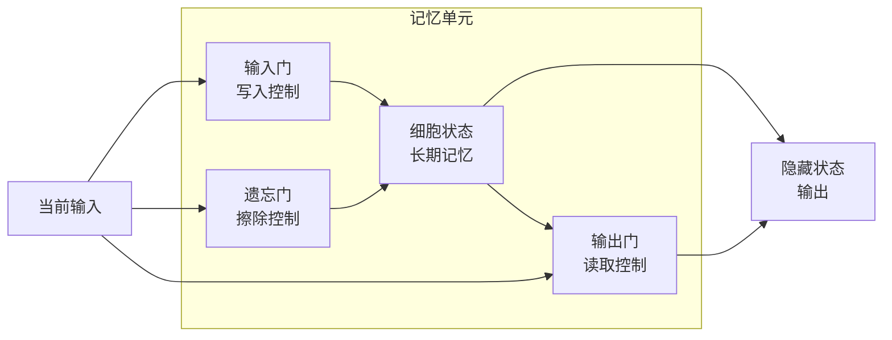

在你阅读的深度学习论文和相关讨论中，**LSTM** 是 **Long Short-Term Memory**（长短期记忆网络）的缩写。它是一种**专门为克服传统RNN的梯度消失问题而设计的循环神经网络变体**。

LSTM 的核心思想可以概括为：**通过引入精巧的“门控”结构，让网络能够选择性地记住或遗忘信息，从而有效地学习长序列中的长期依赖关系。**

---

### 🧠 核心思想：记忆与遗忘的“智能控制”

你可以把 LSTM 想象成一个**带有智能读写功能的记忆单元**。它不像传统RNN那样简单地覆盖隐藏状态，而是通过三个“门”来精细地控制信息的流动：

#### 三个门的作用

| 门的名称 | 作用 | 类比 |
| :--- | :--- | :--- |
| **遗忘门** | 决定从“长期记忆”（细胞状态）中**删除哪些旧信息**。 | 决定是否要忘记一个旧的事实。 |
| **输入门** | 决定将当前输入中的**哪些新信息写入**长期记忆。 | 决定是否要记住一个新的重要信息。 |
| **输出门** | 决定基于当前的长期记忆，**生成什么作为当前时刻的输出**。 | 决定基于已知事实，如何回答当前问题。 |

#### 细胞状态：真正的“记忆”

LSTM 的一个关键创新是引入了 **“细胞状态”**（Cell State），它是一条贯穿整个序列的“信息传送带”。信息可以在上面几乎不受阻碍地流动，只有通过门的精细控制才会被修改。这使得梯度在反向传播时能沿着细胞状态这条“高速公路”顺畅地传递，从而有效缓解了梯度消失问题。

### 🆚 LSTM vs. 传统 RNN

| 特性 | 传统 RNN | LSTM |
| :--- | :--- | :--- |
| **核心结构** | 一个简单的 Tanh 层 | 三个门控结构 + 细胞状态 |
| **长期记忆能力** | **差**，容易遗忘早期信息 | **强**，可以记住很久以前的信息 |
| **梯度消失问题** | **严重**，难以训练长序列 | 大大缓解，能够训练长序列 |
| **计算复杂度** | 低 | 较高 |
| **参数数量** | 少 | 多（约为RNN的4倍） |

### 🚀 简化版：GRU（门控循环单元）

由于 LSTM 的结构相对复杂，研究者提出了 GRU（Gated Recurrent Unit）作为简化版。它合并了“遗忘门”和“输入门”为一个 **“更新门”**，并混合同样负责重置记忆的 **“重置门”**，因此参数更少、计算更快，性能与 LSTM 相近。

### 🔗 在《GeneralVLA-2》论文中的位置

在《GeneralVLA-2》这类以3D视觉和Transformer为主的论文中，LSTM 的可能应用场景相对有限，更可能出现在以下背景或边缘环节：

1.  **作为“相关工作”的背景**：在引入序列处理的历史时，论文会提到 RNN/LSTM 曾是标准方法，但已被 Transformer 取代。
2.  **用于处理时间序列的模块**：如果论文涉及处理视频序列或机器人传感器的时间序列数据，LSTM 可能是一个候选方案，但更可能被 Transformer 或 GRU 替代。
3.  **用于底层特征编码**：在某些点云处理或特征聚合模块中，可能会使用 LSTM 来融合顺序信息。

### 💎 一句话总结

在深度学习论文中，**LSTM** 是一种通过**门控机制**和**细胞状态**来有效解决**长期依赖问题**的 RNN 变体。它通过精细控制信息的遗忘与存入，让网络能够学习长度序列中的长期模式，曾是 NLP 和序列建模的霸主，但目前在许多领域已被 Transformer 架构取代。

---
**相关概念速查**：
- **长期依赖**：需要利用序列中较早时刻信息来影响当前预测的问题。
- **梯度消失**：深层网络中梯度指数级衰减导致前层难以训练的问题。
- **细胞状态**：LSTM 中专用于存储长期记忆的信息通道。
- **GRU**：LSTM 的简化变体，参数更少、计算更快。
- **门控机制**：通过 Sigmoid 函数控制信息流动比例的结构。

## 相关

- [[ReLU]]
- [[梯度消失]]
- [[Transformer]]
- [[前馈神经网络]]
- [[全局感受野]]
- [[VGGT]]
- [[MV-SAM3D]]
