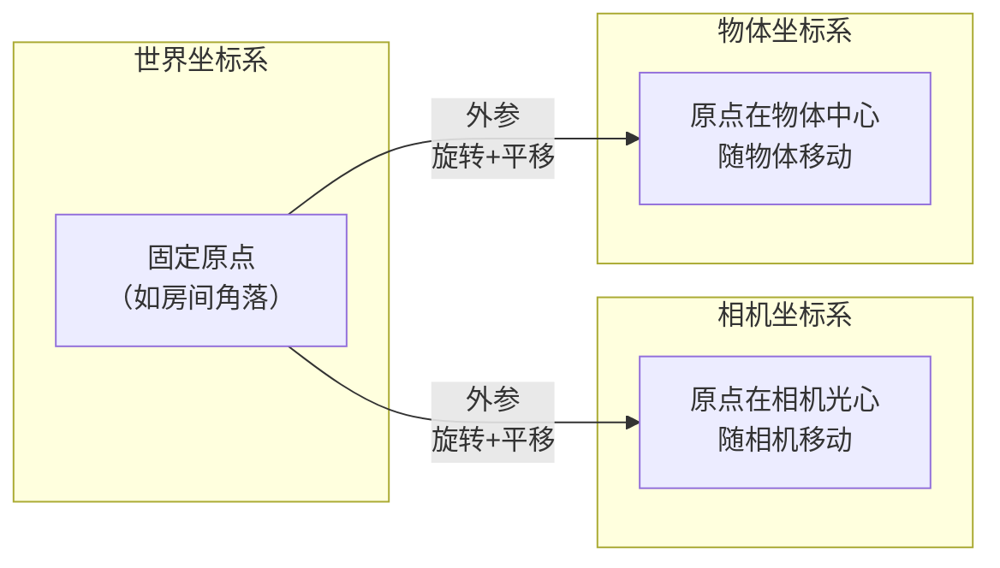

在你正在阅读的《GeneralVLA-2》这类3D视觉与机器人论文中，**世界坐标系**是一个**固定不变的、全局统一的参考框架**，用于描述场景中所有物体和相机位置的**绝对空间位置**。

它是一个“上帝视角”的参考系，独立于任何观察者。可以把它想象成在真实物理空间中，用经纬度和海拔来标记一个位置的坐标系统。

---

### 🧭 核心作用：提供“绝对”的参考

世界坐标系的核心价值在于它为所有其他坐标系提供了一个**统一、稳定**的参照标准。在3D重建和机器人系统中，存在多个不同用途的坐标系，理解它们之间的关系，能帮你更清晰地把握论文中的数据处理流程。

| 坐标系名称 | 原点位置 | 是否固定 | 用途 |
| :--- | :--- | :--- | :--- |
| **世界坐标系** | 场景中任意选定的固定点（如房间角落、GPS原点） | **是** | 作为**绝对参考基准**，描述所有物体的**绝对位置**。 |
| **相机坐标系** | 相机光心（镜头中心） | **否**（随相机移动） | 描述3D点相对于相机的**位置**，是相机看到的世界。 |
| **物体坐标系** | 物体自身的中心或某个关键点 | **否**（随物体移动） | 描述物体**自身**的几何形状，与物体在场景中的位置无关。 |
| **图像坐标系** | 图像的左上角或中心（2D像素） | **否**（随图像变化） | 描述3D点在**2D照片上的投影位置**。 |

### 🔄 坐标变换：连接不同坐标系

不同坐标系之间的转换是通过**外参**（旋转矩阵 R 和平移向量 t）来实现的。比如，将一个点从**世界坐标系**转换到**相机坐标系**的公式是：

> **P_cam = R · P_world + t**

其中，`R` 和 `t` 就是相机的外参，描述了相机在世界坐标系中的**朝向**和**位置**。在《GeneralVLA-2》这类多视角重建论文中，这个外参通常由输入图像提供（或由VGGT等模型估计得到），是整个重建流程的**关键输入**。

---

### 🎯 在《GeneralVLA-2》论文中的具体体现

结合我们之前讨论的内容，世界坐标系在你的论文流程中扮演着“基础底座”的角色：

1.  **作为多视角融合的“公共空间”**：来自不同视角的图像数据，通过各自的外参，被**转换到同一个世界坐标系下**进行融合和对齐。这是实现多视角几何验证的前提。
2.  **重建结果的输出空间**：MV-SAM3D 和 GeoFuse-MV3D 重建出的3D高斯点云，其坐标位置正是位于**世界坐标系**下的。
3.  **与“Ego-Centric”的关系**：你之前问到的 **Ego-Centric几何先验**，指的是以**机器人自身为中心**的局部参考系。世界坐标系和自中心坐标系之间也需要通过坐标变换来相互转换，以服务于不同的下游任务。

---

### 💎 一句话总结

在3D视觉与机器人论文中，**世界坐标系**是一个**固定的、全局统一的绝对参考框架**。它作为所有其他坐标系（如相机坐标系、物体坐标系）的最终参照，为多视角数据融合、3D重建和机器人全局定位提供了统一的空间基准。

---
**相关概念速查**：
- **相机坐标系**：以相机光心为原点的局部3D坐标系。
- **物体坐标系**：以物体自身中心为原点的局部3D坐标系。
- **外参**：描述相机在世界坐标系中位置和朝向的参数（R 和 t）。
- **内参**：描述相机内部光学特性（焦距、主点等）的参数。
- **刚体变换**：只包含旋转和平移，不改变物体形状的坐标变换。

## 相关

- [[Ego-Centric坐标系]]
- [[统一世界坐标系]]
- [[World-Centric（世界中心坐标系）]]
- [[Ego-centric几何先验]]
- [[全局基准参考系]]
