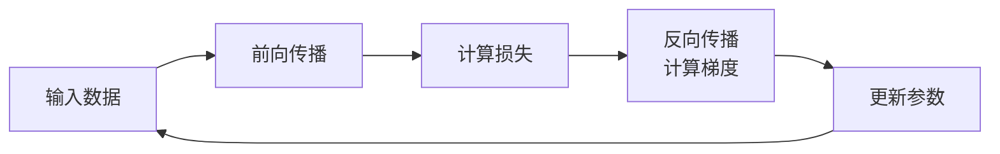

在你阅读的深度学习论文和相关讨论中，**反向传播**（Backpropagation）是训练神经网络的**核心算法**。它不是一个网络模块，而是一个**数学过程**，用来**计算网络中每个参数（权重和偏置）对最终损失函数的贡献（即梯度）**，从而指导参数如何更新以减少误差。

可以把它理解为 **“将最终的误差，从输出端逐层‘分发’回每一个神经元，并据此调整其内部旋钮”**的过程。

---

### 🧠 核心原理：从误差到梯度

反向传播的运作，可以分解为两个清晰的阶段，与我们之前聊的**前馈**和**链式法则**紧密相关：

1.  **前向传播**：输入数据通过网络的各层，逐层计算并传递，最终生成一个预测结果。
2.  **计算损失**：将预测结果与真实标签进行比较，计算出**损失值**（一个标量，表示预测有多不准）。
3.  **反向传播（关键步骤）**：利用微积分中的**链式法则**，从输出层开始，**逐层向前**计算损失值相对于**每一层权重**的偏导数（即梯度）。这个梯度指明了：**如果微调这个权重，损失值会如何变化**。
4.  **更新参数**：根据计算出的梯度，使用优化器（如SGD、Adam）对权重进行微调，使得下一次前向传播的损失变小。

### ⚙️ 它是如何工作的？

这是一个经典的“反馈环路”：

这个循环会持续进行，直到网络的表现达到预期的水平。

### 🔗 与“链式法则”和“可微分渲染”的关系

你之前问到的这两个概念，在这里恰好汇合：

-   **链式法则**是反向传播的**数学基础**。正是因为它，一个复杂的多层复合函数的梯度才能被一层层地分解并计算出来。
-   **可微分渲染器**是反向传播的一个**高级应用**。它使得渲染这个“复杂函数”也变得可求导，从而让渲染误差的梯度能反向传播回3D场景的几何、材质、光照等参数，实现端到端的优化。

### 🔗 在《GeneralVLA-2》论文中的体现

在你的论文中，反向传播是所有可训练模块能够“学习”的根本前提：

1.  **训练视觉编码器**：通过反向传播，图像特征提取模块学会了如何从原始像素中提取有用的信息。
2.  **训练Transformer模块**：多视角特征融合和关系建模的能力，依赖于反向传播来调整其自注意力和前馈网络中的权重。
3.  **优化几何与材质**：当使用可微分渲染器时，反向传播将渲染误差的梯度一路传回，直接修正预测的几何点云位置、材质参数和光照分布。

### 💎 一句话总结

在深度学习论文中，**反向传播**是利用**链式法则**从输出端向输入端**逐层计算损失函数梯度**的算法。它是神经网络**能够从数据中学习**的核心机制，也是端到端训练的理论基础。

---
**相关概念速查**：
- **前向传播**：数据从输入到输出的计算过程。
- **损失函数**：衡量模型预测与真实标签差距的标量。
- **梯度**：损失函数相对于参数的偏导数，指示了参数调整的方向和幅度。
- **优化器**：利用梯度来更新参数的算法（如SGD、Adam）。
- **链式法则**：反向传播计算梯度的数学工具。

## 相关

- [[ReLU]]
- [[梯度消失]]
- [[Transformer]]
- [[前馈神经网络]]
- [[全局感受野]]
- [[VGGT]]
- [[MV-SAM3D]]
