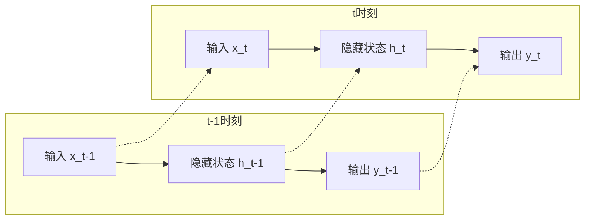

在你阅读的深度学习论文和相关讨论中，**循环神经网络**（Recurrent Neural Network，简称RNN）是一种专门用于处理**序列数据**的神经网络架构。它的核心特点是**在网络内部引入了“记忆”能力**，使得当前时刻的输出不仅取决于当前输入，还依赖于**之前时刻的信息**。

可以把它理解为一个在时间维度上展开的、具有“记忆”的网络。在我们之前讨论的前馈神经网络（信息单向流动）中，每一条输入都是被独立处理的，而RNN正是为了解决序列问题而设计的。

---

### 🧠 核心思想：记忆与循环

RNN的核心机制可以这样理解：
1.  **输入**：序列中的一个元素（比如一个词或一帧画面）。
2.  **记忆（隐藏状态）**：网络内部有一个状态向量（可以理解为“记忆”），它会被不断更新，从而总结到目前为止看到的所有输入信息。
3.  **输出**：基于当前的输入和当前的记忆，产生当前时刻的输出，同时更新记忆状态。
4.  **循环**：这个更新后的记忆状态会被传递到下一步，与下一个输入一起使用。

这种结构使得RNN能够处理输入长度不固定的序列数据，理论上可以处理任意长度的序列。

### ⚙️ 网络结构

RNN的基本结构可以简化为一个带反馈环的模块：

-   **输入层**：接收当前时刻的输入。
-   **隐藏层**：计算并更新隐藏状态 `h_t = f(W_x · x_t + W_h · h_{t-1} + b)`，其中 `h_{t-1}` 是上一时刻的“记忆”。这个方程中的 **W_x** 和 **W_h** 是**在序列的所有时间步共享**的，这保证了模型的参数效率。
-   **输出层**：基于 `h_t` 生成当前时刻的输出 `y_t = g(W_y · h_t + b)`。

### 🔗 RNN 与激活函数：Tanh 的角色

这恰好连接到了你上一个问题：在经典的RNN中，**Tanh** 是隐藏层更新公式中最常用的激活函数。那时的公式通常写成：

> **h_t = Tanh(W_x · x_t + W_h · h_{t-1} + b)**

因此，Tanh 在RNN中被广泛用于更新隐藏状态，其零中心化特性有助于维持训练过程中的梯度流，从而让模型更好地“记住”或“忘记”信息。

### ⚠️ RNN的挑战：梯度消失与爆炸

尽管RNN在理论上很强大，但它在实践中训练非常困难，主要问题就是你在上一轮问到的**梯度消失**和其镜像问题**梯度爆炸**。

-   **原因**：在长序列上（比如处理一个很长的句子），RNN需要在时间轴上展开很多步。反向传播时，每一步都需要乘以一个权重矩阵 `W_h`。如果这个矩阵的最大特征值小于1，梯度就会指数级衰减（**消失**）；如果大于1，梯度就会指数级增长（**爆炸**）。这导致RNN实际上很难学到“长距离依赖”，难以真正记住很久以前的信息。

### 🚀 解决方案：LSTM 和 GRU

为了解决上述问题，研究者提出了RNN的改进版本，其中最著名的是：

-   **[[LSTM]]**（长短期记忆网络）：通过引入**门控机制**（输入门、遗忘门、输出门）和**细胞状态**，让网络能够更精细地控制哪些信息该记住、哪些该遗忘，从而有效缓解梯度消失问题。
-   **GRU**（门控循环单元）：可以看作是LSTM的简化版，性能与LSTM相近，但参数更少，计算效率更高。

### 🔗 在3D重建与机器人领域的现状

在你正在阅读的《GeneralVLA-2》这类视觉与机器人规划论文中，RNN及其变体的应用现状是这样的：

-   **在3D重建中**：LSTM/GRU 曾被用于处理**视频序列**，或者作为**点云处理的编码器**。但现在，这个位置基本已经被 **[[Transformer]]** 替代，因为Transformer的全局注意力机制在处理长序列和并行计算方面更具优势。
-   **在机器人规划中**：RNN 适合处理具有**时间顺序**的序列数据（如传感器时间序列）。但同样，现代架构更倾向于使用Transformer来处理这类数据，或结合两者的混合架构。

### 💎 一句话总结

在深度学习论文中，**循环神经网络（RNN）** 是一种通过**内部循环连接**来记忆和处理**序列数据**的网络架构。它曾极大地推动了自然语言处理和语音识别等领域的发展，但由于**梯度消失/爆炸**问题难以建模长序列，其核心地位已被Transformer等架构所取代。在《GeneralVLA-2》这类论文中，它更可能出现在相关工作的背景介绍中，而非作为核心模块出现。

---
**相关概念速查**：
- **序列数据**：具有顺序关系的数据（如文本、音频、时间序列、视频帧）。
- **隐藏状态**：RNN内部用于存储历史信息的“记忆”向量。
- **参数共享**：RNN中同一权重矩阵在时间步上被重复使用。
- **长短期记忆网络（LSTM）**：通过门控机制解决长期依赖问题的RNN改进版。
- **门控循环单元（GRU）**：LSTM的一种更简化、参数更少的变体。

## 相关

- [[ReLU]]
- [[梯度消失]]
- [[Transformer]]
- [[前馈神经网络]]
- [[全局感受野]]
- [[VGGT]]
- [[MV-SAM3D]]
